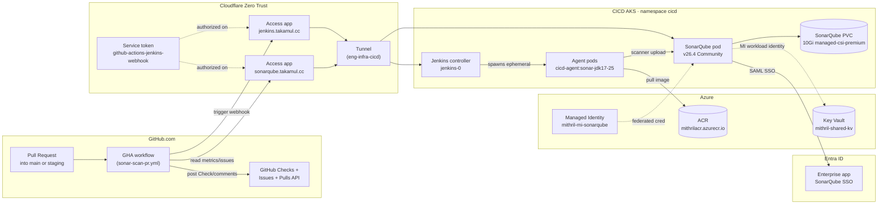
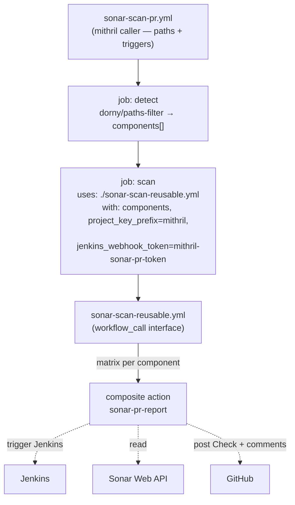
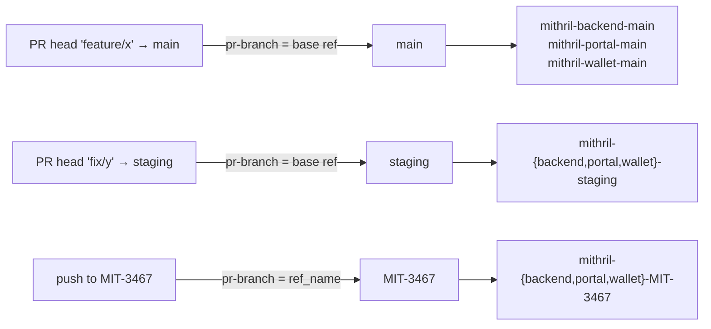

# SonarQube CI/CD — System Documentation

> What this system does, how it's wired, how to operate it.
> Entry point for humans. Detailed task-by-task history lives in `T01.md`–`T16.md`;
> ongoing operational status in `STATE.md`; gotchas in `FINDING.md`;
> rollback recipes in `REVERT.md`; per-repo onboarding in `REUSE.md`.

---

## Contents

1. [What this is](#1-what-this-is)
2. [Architecture](#2-architecture)
3. [Pipeline anatomy](#3-pipeline-anatomy)
4. [GitHub Actions integration](#4-github-actions-integration)
5. [What PR reviewers see](#5-what-pr-reviewers-see)
6. [Secrets & credentials inventory](#6-secrets--credentials-inventory)
7. [Common operations](#7-common-operations)
8. [Known limitations](#8-known-limitations)
9. [Future work](#9-future-work)
10. [Reference index](#10-reference-index)

---

## 1. What this is

A SonarQube Community Build server deployed on Azure, integrated with Jenkins and GitHub Actions to give the mithril team **PR-time static analysis feedback** without losing the existing Jenkins-driven CI infrastructure.

Concretely, on every PR into `main` or `staging` that touches `backend/`, `portal/`, or `wallet/`:

1. GitHub Actions fans out one scan per changed component.
2. Each scan triggers a Jenkins pipeline via a Cloudflare-tunneled webhook.
3. Jenkins runs the gradle/sonar-scanner against the in-cluster SonarQube.
4. SonarQube's quality-gate verdict drives the Jenkins build status.
5. GitHub Actions polls Jenkins, reads SonarQube's metrics via the Web API, and posts back a GitHub Check + PR comment + inline review comments on diff lines.

Other takamulai repos can adopt the same pipeline by writing a short caller workflow — see `task/REUSE.md`.

---

## 2. Architecture

### 2.1 Infrastructure layout



### 2.2 Where each piece lives

| Component | Location | Owner |
|---|---|---|
| SonarQube server | `https://sonarqube.takamul.cc` (CICD AKS, in-cluster `sonarqube-sonarqube.cicd.svc:9000`) | this rollout |
| Jenkins | `https://jenkins.takamul.cc` (same AKS, namespace `cicd`) | platform |
| Cloudflare tunnel | `eng-infra-cicd` (Cloudflare Zero Trust → Tunnels) | platform |
| Cloudflare Access apps | `jenkins.takamul.cc`, `sonarqube.takamul.cc` | this rollout (per-app policies) |
| `cicd-agent` image | `mithrilacr.azurecr.io/cicd-agent:sonar-jdk17-25-bef7e41` (current pin) | this rollout (custom rebuild) |
| Sonar SAML app | Entra ID `SonarQube SSO`, appId `6fcb272d-…` | Application Admin (Rohit) |
| Sonar admin password | KV `cicd-sonarqube-admin-password` | this rollout |
| Sonar SAML cert | KV `cicd-sonarqube-saml-cert` | this rollout |
| Sonar global analysis token | KV `cicd-sonarqube-token` | this rollout |
| GH Packages PAT (backend gradle) | KV `cicd-github-packages-token` | this rollout |
| Jenkins JCasC config | `eng-infra/cicd/k8s/jenkins/values.yaml` | this rollout (extended) + platform |
| GHA workflow + action | `mithril/.github/workflows/{sonar-scan-pr,sonar-scan-reusable}.yml`, `mithril/.github/actions/sonar-pr-report/` | this rollout |

---

## 3. Pipeline anatomy

Two Jenkins jobs cooperate. The outer **`sonar-pr`** wrapper accepts the webhook from GHA; the inner **`sonar-scan`** does the actual gradle/scanner work. Splitting them means GHA can fire one tiny request and the wrapper handles validation, parameter forwarding, and result propagation.

### 3.1 Jenkins `sonar-scan` (inner / worker)

Path: `mithril/modular-jobs/sonar-scan`. Source: `mithril/iac/eng-infra/cicd/pipelines/modules/sonar-scan.Jenkinsfile`.

| Parameter | Default | Meaning |
|---|---|---|
| `PIPELINE_BRANCH` | `MIT-3467` (becomes `main` post-merge) | branch to load this Jenkinsfile from |
| `COMPONENT` | `backend` (choice: backend/portal/wallet) | which sub-project to scan |
| `COMMIT_SHA` | empty (= HEAD of `PIPELINE_BRANCH`) | exact commit to check out for the scan |
| `BRANCH` | `MIT-3467` | suffix in the Sonar project key |

Per-component scan logic:

| Component | Steps | Output |
|---|---|---|
| `backend` | `./gradlew clean test jacocoTestReport -x :app:test -x :keycloak-hybrid-pq-provider:test` then `./gradlew sonar -x ... -Dsonar.qualitygate.wait=true` | scan published to `mithril-backend-${BRANCH}` |
| `portal` | `sonar-scanner` directly (no test run; portal has no jest yet) | `mithril-portal-${BRANCH}` |
| `wallet` | `npm install --legacy-peer-deps` then `sonar-scanner` (jest skipped per FINDING §F19c) | `mithril-wallet-${BRANCH}` |

Two skips on backend's gradle test step are documented in FINDING §F19c (Testcontainers needs Docker; one `VaultClientTest` asserts a K8s SA token file is absent which fails inside a K8s pod).

The `cicd-agent:sonar-jdk17-25-bef7e41` agent image carries:
- OpenJDK 25 (default toolchain) + OpenJDK 17 (Keycloak SPI module)
- Node.js 24 + npm 11 (wallet)
- sonar-scanner-cli 6.2.1
- Plus the pre-existing kubectl/helm/oc/az/ansible

Why two JDKs: 16 of backend's modules use `javaVersion=25` but `keycloak-hybrid-pq-provider` pins `keycloakJavaVersion=17` (Keycloak 26 SPI requirement). Gradle's per-module toolchain picks the right one.

### 3.2 Jenkins `sonar-pr` (outer / wrapper)

Path: `mithril/modular-jobs/sonar-pr`. Source: `mithril/iac/eng-infra/cicd/pipelines/modules/sonar-pr.Jenkinsfile`.

JCasC defines a `generic-webhook-trigger` with token `mithril-sonar-pr-token`. The trigger maps JSON body fields to parameters:

```
$.component  → COMPONENT
$.commit_sha → COMMIT_SHA
$.pr_number  → PR_NUMBER
$.pr_branch  → PR_BRANCH    (the PR's BASE branch, e.g. main/staging)
```

The wrapper validates inputs, then dispatches the inner `sonar-scan` job with `wait: true, propagate: true`. The wrapper's final status mirrors the dispatched scan — which means **GitHub Actions only needs to poll the wrapper**, not the inner build.

### 3.3 End-to-end PR scan sequence

```mermaid
sequenceDiagram
  participant Dev as Developer
  participant GH as GitHub
  participant GHA as GHA Runner
  participant CF as Cloudflare Access
  participant J as Jenkins (sonar-pr → sonar-scan)
  participant A as Agent pod
  participant S as SonarQube

  Dev->>GH: open/push PR → main
  GH->>GHA: pull_request event (paths matched)
  GHA->>GHA: detect changed components (dorny/paths-filter)
  Note over GHA: matrix fans out per component
  GHA->>GH: open Check (in_progress)
  GHA->>CF: POST /generic-webhook-trigger/invoke<br/>?token=mithril-sonar-pr-token<br/>+ CF-Access service-token headers
  CF->>J: forward (service token policy matches)
  J-->>GHA: 200 + queue item URL
  GHA->>CF: poll /queue/item/N/api/json<br/>(Basic auth: JENKINS_API_USER+TOKEN)
  CF->>J: forward
  Note over J,A: sonar-pr wrapper dispatches sonar-scan;<br/>agent pod spawns
  A->>S: gradle/scanner upload analysis
  S-->>A: quality-gate verdict (via qualitygate.wait)
  A-->>J: gradle exits 0/1 (gate verdict)
  J-->>GHA: build result (SUCCESS/FAILURE/UNSTABLE)
  GHA->>CF: GET /api/qualitygates/project_status + /api/measures/component<br/>+ /api/issues/search?sinceLeakPeriod=true
  CF->>S: forward (service token policy matches)
  S-->>GHA: gate status + new_* + overall metrics + issues
  GHA->>GH: GET /pulls/N/files (PR diff)
  GHA->>GHA: intersect issues with PR diff line ranges
  GHA->>GH: PATCH Check (success/failure/neutral)
  GHA->>GH: POST/PATCH PR summary comment (marker-keyed)
  GHA->>GH: POST PR review with inline comments (cap 20/component)
```

---

## 4. GitHub Actions integration

### 4.1 Three-layer design

Reuse by other takamulai repos drove this layering:

| Layer | File (in mithril) | What it owns |
|---|---|---|
| **Caller** | `.github/workflows/sonar-scan-pr.yml` | Triggers (`pull_request: branches: [main, staging]`), watched paths, repo-specific component detection (`dorny/paths-filter`). Calls the reusable workflow. |
| **Reusable** | `.github/workflows/sonar-scan-reusable.yml` | `workflow_call` interface. Inputs: `components`, `project_key_prefix`, `jenkins_webhook_token`, optional URL overrides. Declared secrets. Matrix fanout per component → composite action. |
| **Composite action** | `.github/actions/sonar-pr-report/action.yml` | The actual flow: open Check → trigger Jenkins → poll → fetch Sonar → post PR feedback → close Check. ~600 lines bash + python. |

### 4.2 Caller → reusable composition



For a new repo, only the caller is written by the consuming repo. Reusable + action stay in mithril. See `task/REUSE.md` for the template — and note §4 there about the cross-repo composite-action limitation (currently the action's relative path resolves to the *calling* repo's checkout; extracting the action to its own repo unblocks cross-repo adoption).

### 4.3 Project key derivation



PR scans always publish to the BASE branch's project (not the head branch). This keeps the project set bounded to the 6 long-lived projects from T14 Option B (`mithril-${component}-{main,staging}`), avoiding sprawl, at the cost of the race condition documented in §8.3.

### 4.4 Idempotency

Both Checks and PR summary comments PATCH in place across re-runs of the same commit:

- **Checks**: keyed by `(commit_sha, name)` where `name = "SonarQube / ${component}"`. Look up by commit + name; PATCH if found, POST if not.
- **Summary comments**: keyed by a hidden marker `<!-- sonar-${component} -->` as the first line of the comment body. Iterate the PR's comments, find one starting with the marker, PATCH; otherwise POST.

Inline review comments are POSTed fresh on each run as a single review with `event: COMMENT`. They are not currently de-duplicated (a known limitation — re-running adds a new batch).

---

## 5. What PR reviewers see

Three kinds of feedback appear on a PR that touches a watched path:

### 5.1 GitHub Check (one per component)

Named `SonarQube / backend`, `SonarQube / portal`, `SonarQube / wallet`. Conclusion: `success` (gate passed), `neutral` (UNSTABLE), `failure` (gate failed or Jenkins error), `cancelled` (aborted). Output title + summary mirror the PR comment body.

Branch protection can require these checks via repo Settings → Branches. Not currently required (advisory).

### 5.2 PR summary comment (one per component)

Posted on the PR, marker-keyed for idempotent updates. Body:

```
<!-- sonar-portal -->
### SonarQube — portal

_Jenkins build_: [SUCCESS](https://jenkins.takamul.cc/job/.../sonar-pr/30/)  ·  _Commit_: `1fc0c00e`

**Quality Gate**: ✅ Passed

| Metric                | New Code | Project (overall) | QG Threshold |
|-----------------------|---------:|------------------:|:------------:|
| **Issues (new)**      | **0**    | —                 | ✅ ≤ 0       |
| Bugs                  | 0        | 3                 | —            |
| Vulnerabilities       | 0        | 0                 | —            |
| Security Hotspots     | 0        | 5                 | —            |
| Code Smells           | 0        | 158               | —            |
| Coverage              | —        | 0.0%              | —            |
| Duplications          | —        | 12.1%             | —            |
| Lines (added / total) | +0       | 20034             | —            |

[View in SonarQube](https://sonarqube.takamul.cc/dashboard?id=mithril-portal-main)
```

The **QG Threshold** column joins per-row from the `qualitygates/project_status` `conditions[]` response — `✅`/`❌` from `.status`, comparator rendered as `≤`/`≥`/`=`/`≠`, plus the threshold value. Metrics not in the gate show `—`.

### 5.3 Inline review comments

For each Sonar issue with `sinceLeakPeriod=true` that lands on a line the PR touched (added or context line in the diff), the action posts one inline review comment. Capped at 20 per component to avoid spam. Body format:

```
**Sonar CRITICAL**: <message>

Rule: `java:S2095` · [open in Sonar](https://sonarqube.takamul.cc/project/issues?id=mithril-backend-main&issues=<issue-key>)
```

If a run posts inline comments, the next run on the same commit will post a *new* review (not in-place update) — a known minor limitation.

---

## 6. Secrets & credentials inventory

### 6.1 Azure Key Vault (`mithril-shared-kv`, sub `7047239e-...`)

| Secret | Used by | Notes |
|---|---|---|
| `cicd-sonarqube-admin-password` | Sonar local admin | rotated from initial `admin`; FINDING §F10 |
| `cicd-sonarqube-current-admin-password` | chart post-install hook | mirrors admin-password after rotation |
| `cicd-sonarqube-db-password` | unused | embedded data store (no Postgres pod); kept harmless |
| `cicd-sonarqube-monitoring-passcode` | Sonar monitoring endpoint | not exposed externally |
| `cicd-sonarqube-saml-cert` | Sonar SAML SP cert | sourced from Entra federation metadata; F23 |
| `cicd-sonarqube-token` | scanner / read auth | global analysis token, 1y expiry |
| `cicd-github-packages-token` | backend gradle | classic PAT, scopes `read:packages,repo,workflow`; FINDING §F19c |

### 6.2 Jenkins credentials (via JCasC, populated from K8s Secret `cicd-credentials`)

| Credential ID | Type | Source | Purpose |
|---|---|---|---|
| `github-ssh` | basicSSHUserPrivateKey | KV `cicd-github-ssh-key` | git clone over SSH |
| `sonar-token` | string | KV `cicd-sonarqube-token` | `-Dsonar.token=...` in scanner invocations |
| `github-packages` | usernamePassword | KV `cicd-github-packages-token` + hardcoded username `tahir-takamul` | backend `./gradlew test` resolves `com.takamul:vault-crypto-*` from `maven.pkg.github.com` |
| `okd-deployer-token` | string | KV `cicd-okd-deployer-token` | unrelated (legacy OKD), kept |
| `browserstack-*`, `asc-*` | various | KV | unrelated, kept |

### 6.3 GitHub Actions secrets (repo or org level)

| Secret | Used by | Where to set |
|---|---|---|
| `CF_ACCESS_CLIENT_ID` | every Jenkins/Sonar API call from GHA | Cloudflare Zero Trust → Access → Service Auth |
| `CF_ACCESS_CLIENT_SECRET` | same | same |
| `JENKINS_API_USER` | polling Jenkins queue + builds | the SAML user's email, lowercased (e.g. `mohd.tahir@takamul.ai`) |
| `JENKINS_API_TOKEN` | same | Jenkins UI → user → Configure → API Tokens. **Must be generated via SAML-authenticated UI** — local admin password is defunct, FINDING §F25. |
| `SONARQUBE_READ_TOKEN` | Sonar Web API reads | Sonar UI → My Account → Security → Generate Tokens |

Org-level secrets recommended once a second repo onboards — set under takamulai org → Settings → Secrets → New organization secret.

### 6.4 Cloudflare Access

- **Service token** `github-actions-jenkins-webhook` (Terraform: `cloudflare_zero_trust_access_service_token.github_actions`). Authorized via two policies:
  - `cicd_service_token` on `jenkins.takamul.cc`
  - `cicd_service_token_sonar` on `sonarqube.takamul.cc` (added in T16 polish)

Both policies reference the same service-token UUID. CF Access service tokens are application-scoped — see FINDING §F26.

---

## 7. Common operations

### 7.1 Manually trigger a Jenkins scan

Click "Build with Parameters" on `mithril/modular-jobs/sonar-scan` and pick `COMPONENT` + leave the rest at defaults.

### 7.2 Manually fire the webhook (smoke test)

From a workstation (CF Access service token needed):

```bash
curl -X POST \
  -H "CF-Access-Client-Id: $CF_ID" \
  -H "CF-Access-Client-Secret: $CF_SECRET" \
  -H "Content-Type: application/json" \
  -d '{"component":"portal","commit_sha":"<sha>","pr_number":"0","pr_branch":"main"}' \
  https://jenkins.takamul.cc/generic-webhook-trigger/invoke?token=mithril-sonar-pr-token
```

From inside the cluster (skips CF Access):

```bash
kubectl -n cicd run smoke --rm -i --restart=Never --image=curlimages/curl:8.10.1 --command -- \
  curl -X POST -H "Content-Type: application/json" \
    -d '{"component":"portal","commit_sha":"<sha>","pr_number":"0","pr_branch":"main"}' \
    "http://jenkins.cicd.svc.cluster.local:8080/generic-webhook-trigger/invoke?token=mithril-sonar-pr-token"
```

### 7.3 Manually fire the GHA workflow

GitHub UI → Actions → "SonarQube PR Scan" → Run workflow → pick component + leave commit empty.

Or via `gh`:

```bash
gh workflow run sonar-scan-pr.yml --ref MIT-3467 -f component=portal
```

### 7.4 Onboard a new component

1. Add `<component>/sonar-project.properties` (mirror `portal/sonar-project.properties` structure; set `sonar.projectKey=mithril-<component>-main`, `sonar.projectName=mithril-<component>-main`, `sonar.sources=src`).
2. Update `iac/eng-infra/cicd/pipelines/modules/sonar-scan.Jenkinsfile`: add the new component to the `choice` parameter + add a `case '<component>':` block with the right scanner invocation.
3. Update `eng-infra/cicd/k8s/jenkins/values.yaml`: extend the JCasC `sonar-scan` job's `choices` list.
4. Update `.github/workflows/sonar-scan-pr.yml`: add the path to the `paths:` filter + add a `<component>: ['<component>/**']` line to the dorny filter + add to the workflow_dispatch component options.
5. Run `./deploy.sh cloud playbooks/01-jenkins.yml` from `eng-infra/cicd/ansible/` to refresh JCasC.
6. Sonar project auto-creates on first scan.

### 7.5 Onboard a new repo

See `task/REUSE.md` — three steps: new JCasC job in eng-infra, GHA secrets at org level (one-time), caller workflow file in the new repo.

### 7.6 Rotate a token

| Token | How |
|---|---|
| `SONARQUBE_READ_TOKEN` (GHA) | Sonar UI → My Account → Security → revoke + regenerate. Update GHA secret. |
| `JENKINS_API_TOKEN` (GHA) | Jenkins UI → User → Configure → API Tokens → revoke + add new. Update GHA secret. |
| `cicd-github-packages-token` (KV) | GitHub Settings → Developer Settings → revoke. Mint new classic PAT with `read:packages`. `az keyvault secret set --vault-name mithril-shared-kv --name cicd-github-packages-token --value '<new>'`. Re-run `01-jenkins.yml` ansible to push to K8s Secret. |
| `CF_ACCESS_CLIENT_*` (GHA) | Cloudflare Zero Trust → Access → Service Auth → re-roll. Update both GHA secrets. |
| `cicd-sonarqube-token` (KV) | Sonar UI → Administration → Security → regenerate global analysis token. `az keyvault secret set ...`. Re-run `01-jenkins.yml`. |

### 7.7 Debug a failed PR scan

1. **Check the GHA run** (Actions tab of the PR). The composite action logs each phase (Open Check → Trigger → Poll → Fetch Sonar → Post PR feedback → Close Check).
2. **Click through to Jenkins** via the link in the GHA log or the Check summary. Look at the `sonar-pr` wrapper build, then the linked `sonar-scan` build for the actual error.
3. **Common failure modes:**
   - `Jenkins API auth failed (HTTP 401/403)` → `JENKINS_API_USER` or `JENKINS_API_TOKEN` stale or wrong. Verify via the runbook test command (REUSE §6).
   - `403 from Sonar` with CF telemetry fields (`ray_id`, `aud`) → service token not authorized on the Sonar Access app (FINDING §F26).
   - Backend `Could not resolve com.takamul:...` → `github-packages` credential missing or stale.
   - Wallet `npm install ... ERESOLVE` → `--legacy-peer-deps` flag missing or wallet deps changed (FINDING §F27).
   - `Toolchain installation '...' does not provide JAVA_COMPILER` → cicd-agent image missing required JDK; check active pin in `sonar-scan.Jenkinsfile` matches what's actually pushed in ACR.

---

## 8. Known limitations

### 8.1 Community Build constraints (FINDING §F16)

- Only `main` is stored per project; no native branch or PR analysis. We approximate per-PR isolation via base-branch-suffixed project keys plus diff-intersection for inline comments.
- "New code period" is set to `previous_version` mode by default. Each scan re-establishes the baseline.

### 8.2 Skipped tests in backend gradle (FINDING §F19c)

- `:app:test` — Testcontainers needs a Docker daemon. AKS uses containerd; no socket exposed. App module loses Sonar coverage; static analysis still runs.
- `:keycloak-hybrid-pq-provider:test` — one test (`VaultClientTest.k8sLogin_failedAuth_throwsException`) assumes the K8s SA token file at `/var/run/secrets/kubernetes.io/serviceaccount/token` is absent. In a K8s pod it IS mounted, so the asserted error path never fires.
- Wallet jest entirely skipped — 18 of 25 suites fail with mix of `transformIgnorePatterns` gaps (`@noble/hashes` ESM), missing native-module mocks (`react-native-encrypted-storage`, `-biometrics`, `-config`), and stale assertions.

All three are repo-team-side debt; restoration paths documented in §F19c.

### 8.3 Concurrent PR scans race (FINDING §F28)

PRs into the same base branch publish to the same Sonar project. Sonar's Compute Engine serializes processing (no data corruption), but the LAST analysis to finish is what GHA's metric reads will see. Three failure modes:

1. Stale dashboard link (shows another PR's data).
2. Wrong-PR inline comments (issues from another PR's scan).
3. Wrong-PR metric numbers in the Check summary.

The Check's pass/fail conclusion remains correct (Jenkins waits for its own analysis's quality-gate verdict via `qualitygate.wait=true`). Only the enrichment numbers race. Accepted at the team's ~50 PR/day volume because alternatives (GHA-level serialization, per-PR project keys + cleanup, Developer Edition) all have larger costs.

### 8.4 Cross-repo composite action (REUSE.md §4)

The reusable workflow uses `uses: ./.github/actions/sonar-pr-report` — relative path resolves to the calling repo's checkout. Works for mithril, fails for any other repo. Fix when onboarding repo #2: extract the action to its own repo (`takamulai/gha-sonar-pr-action`).

### 8.5 Inline comment re-run behavior

A second scan on the same PR commit re-POSTs a fresh review with inline comments. They don't de-duplicate. Mitigation: re-runs of the same commit are rare; force-push triggers a synchronize event with a new commit (and therefore new review attached to the new SHA).

### 8.6 Sonar Project History — not preserved per-PR

Sonar Community Build keeps analysis history per project, not per branch/PR. Once a project is overwritten by the next PR's scan, the previous PR's analysis details are gone. Jenkins build URLs preserve the raw scanner log and parameters as long as Jenkins build retention allows (default ~30 days).

---

## 9. Future work

### 9.1 Featured: T17 candidate — adopt `sonarqube-community-branch-plugin`

**Source**: <https://github.com/mc1arke/sonarqube-community-branch-plugin> · LGPL-3.0 · 2.7k stars · plugin release `26.4.0` matches our Sonar `26.4.0.121862` (compatibility model is plugin-major.minor == Sonar-major.minor).

**What it gives us**:
- Native branch + PR analysis in Community Build (the feature SonarSource normally locks behind Developer Edition).
- Eliminates §8.3 / FINDING §F28 race condition entirely — each PR scans its own scope within a single Sonar project, no shared project key.
- Real "new code" semantics scoped per-PR vs. target branch (not the current "previous version" approximation).
- Collapses our 6 long-lived projects to **3** (`mithril-backend`, `mithril-portal`, `mithril-wallet`) with branch/PR scopes inside each — no project sprawl, no cleanup hooks needed.

**Migration outline (~5 hours)**:

| Step | What |
|---|---|
| Helm | `eng-infra/cicd/k8s/sonarqube/values.yaml` — add `plugins.install` pointing at the plugin's JAR release URL, `sonar.{web,ce}.javaAdditionalOpts: -javaagent:...`, and the `extraInitContainers` block that unpacks `sonarqube-webapp.zip` into `/opt/sonarqube/web`. Run `06-sonarqube.yml` via deploy.sh. |
| Verify plugin loaded | Sonar UI → Administration → Marketplace → Installed; restart should show plugin in the System info |
| Jenkinsfile | `iac/eng-infra/cicd/pipelines/modules/sonar-scan.Jenkinsfile` — drop the per-branch project-key suffix; pass `-Dsonar.branch.name=$BRANCH` for push scans or `-Dsonar.pullrequest.key=$PR_NUMBER -Dsonar.pullrequest.branch=$HEAD -Dsonar.pullrequest.base=$BASE` for PR scans. Project key collapses to `mithril-${component}`. |
| Composite action | `.github/actions/sonar-pr-report/action.yml` — read per-PR scope via the plugin's API additions (`/api/measures/component?pullRequest=N`, `/api/issues/search?pullRequest=N`); optionally retire the action's PR decoration if we use the plugin's native PR decoration (configurable GitHub App or PAT). |
| Validate | One throwaway draft PR; confirm Sonar UI shows the PR in the project's PR list with isolated metrics. |
| Cleanup | Delete the 3 `-staging` transient projects from the old model in Sonar UI. |
| Docs | Update STATE.md (T17 done), FINDING §F28 (closed → resolved by plugin), SONAR.md §8.3 (limitation removed), T17.md (new file with what shipped). |

**Risks**:
1. Not SonarSource-supported — they warn about it but we're not migrating to commercial editions anyway, so the warning is moot.
2. Tied to maintainer's release cadence. Track record is good (release per Sonar version since 7.x), but worth pinning the version + monitoring releases.
3. Helm chart additions (init container, javaAdditionalOpts) — straightforward but adds moving parts. Revert is `helm upgrade` back to vanilla values; PVC retains all data.

When to do this: when F28 starts visibly biting reviewers (stale metrics in Checks, misleading inline comments). At ~50 PR/day volume that's likely soon.

### 9.2 Other tracked items

| Item | Why | Effort |
|---|---|---|
| Extract composite action to `takamulai/gha-sonar-pr-action` | Unblocks cross-repo adoption of the reusable workflow (REUSE.md §4) | ~half day |
| Promote 5 GHA secrets to org level | Cleaner `secrets: inherit` flow for new repos | ~10 min |
| Flip `PIPELINE_BRANCH` defaults `MIT-3467` → `main` | After MIT-3467 merges; 3 spots in JCasC + 2 Jenkinsfiles | ~10 min |
| Restore `:app:test` via Testcontainers Cloud or remote DOCKER_HOST | Restore app coverage in Sonar | depends on infra choice |
| Restore `:keycloak-hybrid-pq-provider:test` via mocking the SA-token reader | One test, one mock; ~5 lines | ~30 min, backend team |
| Wallet jest setup fixes | `transformIgnorePatterns` + native-module mocks + stale-assertion repair | ~half day, wallet team |
| Wallet `npm install` peer-dep alignment | Remove the `--legacy-peer-deps` workaround | wallet team, opportunistic |
| Required-Check branch protection on `main` | Make Sonar gates merge-blocking | repo settings change, governance call |
| Per-PR Sonar project keys + cleanup hook | Alternative path to fix F28 if §9.1 isn't adopted; adds project sprawl during PR lifetimes; cleanup workflow on PR close | ~1 day |
| Sonar Developer Edition upgrade | Native PR analysis + SonarSource support; license cost (~$1-3K/year) | ~1 hour migration + license procurement |

---

## 10. Reference index

| File | What it has |
|---|---|
| `PLAN.md` | Original rollout plan (pre-T01); historical context |
| `STATE.md` | Live operational status — read first when resuming |
| `T01.md`–`T16.md` | Per-task specs and what shipped |
| `T-Rohit.md` | The Terraform Rohit ran on his workstation for T02 |
| `FINDING.md` | Numbered gotchas (F01–F28) discovered during the rollout |
| `REVERT.md` | What's been created and how to undo each piece |
| `REUSE.md` | Onboarding guide for any takamulai repo to adopt the same PR scan |
| `logs/` | Apply logs, Jenkins console snapshots, ACR build logs |

External references:

- Sonar Web API docs: <https://docs.sonarsource.com/sonarqube-community-build/extension-guide/web-api/>
- Jenkins generic-webhook-trigger: <https://plugins.jenkins.io/generic-webhook-trigger/>
- GitHub reusable workflows: <https://docs.github.com/en/actions/sharing-automations/reusing-workflows>
- Cloudflare Access service tokens: <https://developers.cloudflare.com/cloudflare-one/identity/service-tokens/>
