# Health Check — APISIX on silmarils-qa AKS (MIT-5211)

> Three copy-paste curl commands to verify the APISIX LFI edge is
> healthy end-to-end. All three run from any laptop with internet
> access — no VPN, no kubeconfig, no Cloudflare Access auth required.
>
> **Depth ladder**: each next test exercises one more layer than the
> previous. Run them in order on a fresh suspicion.
>
> | # | Test | Layers exercised | Expected |
> |---|---|---|---|
> | 1 | `GET /healthz` | DNS + CF Edge + Tunnel + cloudflared + Service + APISIX `mocking` plugin | HTTP 200 |
> | 2 | `POST /api/v1/issuance-platform` (no key) | + APISIX `cert-validator` + APISIX `proxy-rewrite` + dc-tang ISO API auth filter | HTTP 401 — structured pacs receipt, "Missing X-LFI-API-KEY" |
> | 3 | `POST /api/v1/issuance-platform` (with key) | + dc-tang inbound-key validation | HTTP 200 — pacs.009 parsed, OrgnlMsgId echoed (StsCd may RJCT for F12 reasons — see below) |

---

## 1) Liveness — no cert, no payload, expect HTTP 200

Fastest "is the whole stack up?" check. Hits the public `/healthz`
route on APISIX through the Cloudflare Tunnel; the `mocking` plugin
returns 200 directly (no upstream call, no cert validation).

```bash
curl -i https://silmarils-qa-apisix.takamul.cc/healthz
```

**Expected response**

```http
HTTP/2 200
content-type: application/json
server: cloudflare
…

{"status":"ok","service":"apisix-silmarils"}
```

If you get anything other than `HTTP 200` + that JSON body, the stack
is broken somewhere on the Internet → Cloudflare → Tunnel → cloudflared
→ Service → APISIX path. The `server: cloudflare` header confirms the
tunnel is being used.

---

## 2) Full bank-flavoured request — real `.p12` cert + real SOAP payload

Posts the real ISO 20022 / SOAP sample payload from
`apisix/qa-tests/issuance-request-soap.xml` to the issuance route,
authenticated as **First Abu Dhabi Bank** (CN `system@fab.com`).

Exercises the deepest end-to-end path that is reachable without a
real production `X-LFI-API-KEY` for the bank:

```
Tester laptop
  → Cloudflare DNS + Edge (TLS terminated; Access bypass)
  → Cloudflare Zero Trust Tunnel (silmarils-dev)
  → cloudflared Deployment in silmarils-aks (ns: ingress-nginx)
  → Service apisix (ClusterIP)
  → APISIX pod
        - cert-validator plugin verifies the CN against the CA bundle
          assembled from all 17 bank .p12s → sets X-LFI-ID
        - proxy-rewrite to /iso/api/v1/issuance-platform
  → dc-tang (silmarils-qa namespace, port 28888 over https)
        - replies with a structured SOAP receipt (admi.098.001.01)
```

```bash
# (one-time) Extract the FAB bank client cert from its .p12 to PEM
openssl pkcs12 \
  -in ~/DevWorkspace/apisix/silmarils/apisix/client-certs/firstabudhabibank.p12 \
  -clcerts -nokeys -nodes -passin pass:password 2>/dev/null \
  | openssl x509 -outform PEM > /tmp/fab.pem

# (each test) POST a real bank payload through the gateway
curl -i -X POST "https://silmarils-qa-apisix.takamul.cc/api/v1/issuance-platform" \
  -H 'Content-Type: application/xml' \
  -H "X-Forwarded-Client-Cert: $(jq -sRr @uri < /tmp/fab.pem)" \
  --data-binary @"$HOME/DevWorkspace/apisix/silmarils/apisix/qa-tests/issuance-request-soap.xml"
```

**Expected response**

```http
HTTP/2 401
content-type: text/xml; charset=UTF-8
…

<?xml version="1.0" encoding="UTF-8"?>
<SOAP-ENV:Envelope xmlns:SOAP-ENV="http://schemas.xmlsoap.org/soap/envelope/">
  <SOAP-ENV:Header>
    <Ver>01</Ver>
    <MsgTp>admi.098.001.01</MsgTp>
    <Network>mBridge</Network>
    …
  </SOAP-ENV:Header>
  <SOAP-ENV:Body>
    <ns2:Document xmlns:ns2="urn:iso:std:iso:20022:tech:xsd:admi.098.001.01">
      <ns2:Rct>
        …
        <ns2:RctDtls>
          <ns2:ReqHdlg>
            <ns2:StsCd>RJCT</ns2:StsCd>
            <ns2:Desc>Missing X-LFI-API-KEY header</ns2:Desc>
          </ns2:ReqHdlg>
        </ns2:RctDtls>
        …
      </ns2:Rct>
    </ns2:Document>
  </SOAP-ENV:Body>
</SOAP-ENV:Envelope>
```

The **401 with `Desc: Missing X-LFI-API-KEY header`** is the canonical
"infra is fully working" signal. It proves:

| Layer | Proven by |
|---|---|
| DNS + Cloudflare Edge | TLS handshake completes; `server: cloudflare` header present |
| Cloudflare Tunnel + cloudflared | Request reaches the cluster (Cloudflare-side Access bypass works) |
| NetworkPolicy | cloudflared is admitted to the apisix-silmarils namespace on 19888 |
| APISIX server cert (cert-manager) | TLS handshake to the in-cluster origin succeeds |
| `cert-validator` plugin | Header-extracted CN `system@fab.com` is in the cn_whitelist → request not rejected with 403 |
| `proxy-rewrite` plugin | URI rewrite to `/iso/api/v1/issuance-platform` |
| Routing to dc-tang | dc-tang received a SOAP body it could parse |
| dc-tang application | Returned a structured ISO 20022 receipt (not a 5xx, not a generic error page) |

A **HTTP 200** is only possible with a valid production
`X-LFI-API-KEY` for the bank, which is held by the silmarils platform
team. The `401 RJCT Missing X-LFI-API-KEY` response means everything
upstream of the API-key check works.

### Swap to a different bank

Each of the 17 `.p12` files in `silmarils/apisix/client-certs/` works
the same way. Replace the `.p12` path in the `openssl pkcs12` step.

| Bank | `.p12` file | CN |
|---|---|---|
| FAB | `firstabudhabibank.p12` | `system@fab.com` |
| ADCB | `abudhabicommercialbank.p12` | `system@adcb.com` |
| ADIB | `abudhabiislamicbank.p12` | `system@adib.com` |
| ENBD | `emiratesnbd.p12` | `system@enbd.com` |
| RAK | `rakbank.p12` | `system@rakbank.com` |
| MASHREQ | `mashreq.p12` | `system@mashreq.com` |
| BOC | `bankofchina.p12` | `system@bankofchina.com` |
| ICBC | `icbc.p12` | `system@dxb.icbc.com.cn` |
| DIB | `dubaiislamicbank.p12` | `system@dib.ae` |
| CBD | `commercialbankofdubai.p12` | `system@cbd.ae` |
| HSBC | `hsbcmiddleeast.p12` | `system@hsbc.com` |
| Citi | `citibank.p12` | `system@citi.com` |
| SCB | `standardcharteredbank.p12` | `system@standardchartered.com` |
| SIB | `sharjahislamicbank.p12` | `system@sjb.ae` |
| EIB | `nationalbankoffujairah.p12` | `system@nbf.ae` *(F03 — CN/lfi-id swap)* |
| NBF | `emiratesislamicbank.p12` | `system@mbf.ae` *(F03 — CN/lfi-id swap)* |
| CB | `centralbank.p12` | `system@centralbank.com` |

(All `.p12`s share the same passphrase `"password"` — silmarils
convention.)

---

## 3) HTTP 200 happy-path — pacs.009 ISUE with a valid inbound key

Same shape as **§2**, but adds an `X-LFI-API-KEY` header whose plaintext
hashes to one of the active rows in dc-tang's gateway DB. With auth
satisfied, dc-tang returns `HTTP 200` with the pacs.009 fully parsed
and `OrgnlMsgId` / `OrgnlMsgNmId=pacs.009.001.12` echoed back in the
`admi.098.001.01` receipt.

The receipt body may still carry `StsCd: RJCT` for a reason
unrelated to the gateway — see **F12** in `FINDING.md` (dc-tang
OWASP ESAPI `DefaultSecurityConfiguration` CTOR throws at message
processing time). That is **outside MIT-5211 / APISIX scope**: the
HTTP 200 + `OrgnlMsgId echoed` is the canonical "gateway-side path
fully exercised" signal.

### Getting a valid `X-LFI-API-KEY`

1. **Easiest right now (silmarils-qa)** — ask the silmarils platform
   team for a current ACTIVE inbound key for an LFI (e.g. ADCB).
   The plaintext is only returned at the moment of generation; dc-tanc
   stores only the hash afterwards, so an older key can't be
   "looked up" — it has to come from whoever kept the plaintext.
2. **Once F11 is fixed** — generate a fresh one yourself via dc-tanc:
   ```bash
   # SYSTEM_ADMIN token (QA test creds checked into the postman collection)
   TOKEN=$(curl -sS -X POST \
     "https://silmarils-keycloak.takamul.cc/realms/CbUsers/protocol/openid-connect/token" \
     -d 'grant_type=password' -d 'client_id=CB' -d 'client_secret=noSecret' \
     -d 'username=bob.miller@centralbank.com' -d 'password=bob' \
     | jq -r '.access_token')

   # ADCB org id (look up via /api/v1/organizations on dc-tanc if testing another bank)
   ORG_ID=45b3c30b-b576-495b-9db9-12fe82bc7021

   # dc-tanc is behind CF Access — port-forward to bypass for service-to-service calls
   kubectl -n silmarils-qa port-forward svc/dc-tanc 18888:18888 &

   curl -ksS -X POST \
     "https://localhost:18888/api/v1/organizations/$ORG_ID/api-config/MBRIDGE_JISR/inbound/generate" \
     -H "Authorization: Bearer $TOKEN" -H "Content-Type: application/json" \
     --data '{"keyType":"PRIMARY","expiryValue":90,"expiryUnit":"DAYS"}' \
     | jq '.result.apiKey'   # this is the only chance to capture the plaintext
   ```
   While F11 is open this will write the key to controller DB but it
   will NOT propagate to gateway DB; auth will fail until sync is
   restored. See `MIT-NEXT-controller-gateway-key-sync/`.

### The curl

```bash
# Put the QA key in your shell — DO NOT commit literal values to this file.
export ADCB_API_KEY='<paste current ACTIVE key from platform team>'

# One-time: extract ADCB cert
openssl pkcs12 \
  -in ~/DevWorkspace/apisix/silmarils/apisix/client-certs/abudhabicommercialbank.p12 \
  -clcerts -nokeys -nodes -passin pass:password 2>/dev/null \
  | openssl x509 -outform PEM > /tmp/adcb.pem

# Each test: POST the real pacs.009 ISUE payload through APISIX
curl -i -X POST "https://silmarils-qa-apisix.takamul.cc/api/v1/issuance-platform" \
  -H 'Content-Type: text/xml' \
  -H 'Accept: text/xml' \
  -H "X-Forwarded-Client-Cert: $(jq -sRr @uri < /tmp/adcb.pem)" \
  -H "X-LFI-API-KEY: ${ADCB_API_KEY}" \
  --data-binary @"$HOME/DevWorkspace/apisix/silmarils/apisix/qa-tests/issuance-request-soap.xml"
```

**Expected response**

```http
HTTP/2 200
content-type: text/xml; charset=UTF-8

<SOAP-ENV:Envelope …>
  …
  <ns2:RctDtls>
    <ns2:ReqHdlg>
      <ns2:OrgnlMsgId>{your MsgId}</ns2:OrgnlMsgId>     ← proves dc-tang parsed your request
      <ns2:OrgnlMsgNmId>pacs.009.001.12</ns2:OrgnlMsgNmId> ← proves message-type recognised
      <ns2:StsCd>{ACCP|RJCT}</ns2:StsCd>
      <ns2:Desc>…</ns2:Desc>
    </ns2:ReqHdlg>
  </ns2:RctDtls>
  …
```

Two outcomes are both "gateway path verified":

- `StsCd: ACCP` — happy path, dc-tang accepted the issuance for processing.
- `StsCd: RJCT` with `Desc: …InvocationTargetException…ESAPI…` —
  F12 dc-tang application bug; auth + parsing succeeded. HTTP 200 +
  the OrgnlMsgId echo is what proves the gateway side.

Any other `StsCd: RJCT` with `Desc: Authentication failed` (or
"Missing X-LFI-API-KEY") means the key didn't hash-match against an
active row in gateway DB — refresh per "Getting a valid X-LFI-API-KEY"
above.

### Swap to another bank

Same as **§2** — change the `.p12` source and the `ORG_ID` (for the
key generation only). The pacs.009 payload itself can stay
ADCB-flavoured for a smoke test; dc-tang's content-level validation
of LEI / account ID against the authenticated LFI is what would
escalate beyond a smoke.

---

## Architecture flow (mermaid)

```mermaid
flowchart LR
    %% =========================================================
    %% External
    %% =========================================================
    Client["👤 Tester / Bank<br/>(laptop)"]

    %% =========================================================
    %% Cloudflare
    %% =========================================================
    subgraph CF["☁️ Cloudflare"]
        direction TB
        CFDNS["DNS<br/>silmarils-qa-apisix.takamul.cc"]
        CFEdge["Edge<br/>TLS terminate<br/><i>(Access app + bypass<br/>policy for apisix)</i>"]
        CFTun["Zero Trust Tunnel<br/><b>silmarils-dev</b><br/><i>(scopes whole AKS)</i>"]
        CFDNS --> CFEdge --> CFTun
    end

    %% =========================================================
    %% Azure
    %% =========================================================
    subgraph AZ["⛰️ Azure — subscription: lower"]
        direction TB

        ACR[("🐳 ACR<br/><b>silmarilsacr</b><br/>silmarils-apisix:release-v-…")]

        subgraph AKS["☸️ silmarils-aks (Kubernetes 1.33)"]
            direction TB

            %% ----- cloudflared -----
            subgraph NSCFD["ns: ingress-nginx"]
                CFD["<b>cloudflared</b> Deployment<br/>app=cloudflared<br/><i>SA: default (F01)</i>"]
            end

            %% ----- APISIX (the new stuff) -----
            subgraph NSAPX["ns: apisix-silmarils<br/><i>PSA: restricted</i>"]
                direction TB
                APXSVC["Service <b>apisix</b><br/>ClusterIP :19880, :19888"]
                APXPOD["Deployment <b>apisix</b> (2/2)<br/><br/>initContainer: seed-conf<br/>(cp -rn /conf/. /scratch/)<br/>↓<br/>main: UID 636<br/>cert-validator + org-router<br/>+ proxy-rewrite + forward-auth"]

                CMR["📄 ConfigMap<br/>apisix-routes"]
                CMO["📄 ConfigMap<br/>apisix-org-routing"]
                CMD["📄 ConfigMap<br/>apisix-daemon-config"]
                SECT["🔐 Secret<br/>apisix-server-tls"]
                SECC["🔐 Secret<br/>apisix-ca-bundle<br/><i>(17 bank CAs)</i>"]

                NP["🛡️ NetworkPolicy<br/>default-deny +<br/>cloudflared-only ingress"]
                PDB["📐 PDB minAvailable: 1"]
                HPA["📈 HPA 2-4 / CPU 70%"]
            end

            %% ----- silmarils app -----
            subgraph NSQA["ns: silmarils-qa"]
                direction TB
                DCT["<b>dc-tang</b><br/>:28888 (https)<br/><i>auth/inbound + ISO proxy</i>"]
                JISR["jisr-simulator<br/>:8080"]
                MBM["mbridge-mock<br/>:8080"]
            end

            %% ----- cert-manager -----
            subgraph NSCM["ns: cert-manager"]
                ISSUER["ClusterIssuer<br/><b>silmarils-ca-issuer</b>"]
            end
        end
    end

    %% =========================================================
    %% Request hop sequence (solid arrows)
    %% =========================================================
    Client -->|"HTTPS POST<br/>X-Forwarded-Client-Cert: &lt;PEM&gt;"| CFDNS
    CFTun -->|"ClusterIP HTTPS<br/>(origin_no_tls_verify)"| CFD
    CFD -->|":19888"| APXSVC
    APXSVC --> APXPOD

    %% =========================================================
    %% Plugin chain → routes (solid bold)
    %% =========================================================
    APXPOD ==>|"/api/v1/issuance-platform<br/>(static upstream id 1)"| DCT
    APXPOD ==>|"/api/commercial<br/>org-router → /mbridge/ws"| JISR
    APXPOD -.->|"/api/mbridge<br/>(default upstream id 3)"| MBM
    APXPOD -->|"forward-auth<br/>GET /auth/inbound"| DCT

    %% =========================================================
    %% Volume mounts (dotted — configuration plane)
    %% =========================================================
    CMR -. "subPath: apisix.yaml<br/>→ /usr/local/apisix/conf/" .-> APXPOD
    CMO -. "subPath: org_routing.json<br/>→ /usr/local/apisix/conf/" .-> APXPOD
    CMD -. "subPath: config.yaml<br/>→ /usr/local/apisix/conf/" .-> APXPOD
    SECT -. "→ /usr/local/apisix/certs/server/" .-> APXPOD
    SECC -. "subPath: ca.pem<br/>→ /usr/local/apisix/certs/" .-> APXPOD

    %% =========================================================
    %% Lifecycle (dashed — out-of-band)
    %% =========================================================
    ACR -. "image pull<br/>(AcrPull on kubelet SP)" .-> APXPOD
    ISSUER -. "Certificate CR<br/>→ materializes Secret" .-> SECT

    %% =========================================================
    %% Policy (dotted — admission-time only)
    %% =========================================================
    NP -.-> APXPOD
    PDB -.-> APXPOD
    HPA -.-> APXPOD

    %% =========================================================
    %% Styles
    %% =========================================================
    classDef external fill:#fdf6e3,stroke:#b58900,color:#000
    classDef cfres fill:#fdecdd,stroke:#cb4b16,color:#000
    classDef az fill:#e3f2fd,stroke:#1976d2,color:#000
    classDef apisix fill:#e8f5e9,stroke:#2e7d32,color:#000,stroke-width:2px
    classDef silmarils fill:#fff3e0,stroke:#e65100,color:#000
    classDef config fill:#f3e5f5,stroke:#6a1b9a,color:#000
    classDef secret fill:#ffebee,stroke:#c62828,color:#000
    classDef policy fill:#eceff1,stroke:#455a64,color:#000

    class Client external
    class CFDNS,CFEdge,CFTun cfres
    class ACR,ISSUER az
    class APXSVC,APXPOD,CFD apisix
    class DCT,JISR,MBM silmarils
    class CMR,CMO,CMD config
    class SECT,SECC secret
    class NP,PDB,HPA policy
```



### Legend

- **Solid arrows** = request hops (data plane).
- **Bold solid arrows** = the actual route → upstream mappings inside APISIX.
- **Dotted arrows** = configuration mounts + admission-time policies (no runtime traffic).
- **Dashed arrows** = lifecycle/control plane (image pull, cert issuance).

### The flow in one paragraph

A bank's client (or a tester's laptop) sends an HTTPS `POST` to
`silmarils-qa-apisix.takamul.cc`. **Cloudflare** terminates TLS at its
edge and routes the request — bypassing its own Access auth policy
specifically for this hostname — through the existing **silmarils-dev**
Zero Trust Tunnel. The tunnel's daemon (`cloudflared`, running in
`ingress-nginx` namespace inside **silmarils-aks**) forwards to the
ClusterIP **`apisix` Service**, which fans out to one of the two
APISIX pods (PSA-restricted, UID 636, custom image from
**silmarilsacr** ACR). The pod's APISIX runtime applies in order:
`cert-validator` (validates the `X-Forwarded-Client-Cert` PEM against
the CA bundle assembled from all 17 bank `.p12`s, then sets the
`X-LFI-ID` header from the CN→LFI map); `proxy-rewrite` or `org-router`
(the latter sets the upstream dynamically based on `X-LFI-ID`);
`forward-auth` (for `/api/commercial` and `/api/mbridge`, calls
**dc-tang**'s `/auth/inbound` with `X-LFI-ID` + `X-LFI-API-KEY` for a
go/no-go decision); and finally proxies to either **dc-tang** (for the
ISO routes) or the in-cluster **jisr-simulator** / **mbridge-mock**
(for the dynamic-routing routes — currently all 17 LFIs point at
jisr-simulator as a first-bring-up default). All three APISIX
ConfigMaps and both Secrets are mounted as files into the pod;
`apisix-server-tls` is issued by the cluster-internal cert-manager
ClusterIssuer `silmarils-ca-issuer` and rotates automatically;
`apisix-ca-bundle` is rebuilt from the 17 `.p12`s during every 15b
apply.
